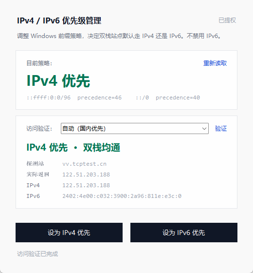

# IPv4IPv6Prefer

Windows 双栈优先级管理工具。通过调整 IPv6 前缀策略表，在 **IPv4 优先** 与 **IPv6 优先** 之间切换，**不禁用 IPv6**。

修改策略需要管理员权限，程序启动时会请求 UAC。

<p align="center">
  
</p>

## 功能

- 读取并显示当前系统策略（`::ffff:0:0/96` 与 `::/0` 的 precedence）
- 一键设为 IPv4 优先或 IPv6 优先
- 对双栈探测站做 Ping 验证（国内站点优先，失败再试国外）

## 环境

- Windows 10 / 11
- 源码运行需要 Python 3.10+（仅用标准库，无需额外依赖）
- 打包 exe 需要 [PyInstaller](https://pyinstaller.org/)

## 下载

预编译程序：[`dist/IPv4IPv6Prefer.exe`](dist/IPv4IPv6Prefer.exe)

## 源码运行

```powershell
python src/main.py
```

## 自行打包

```powershell
.\build.ps1
```

输出：`dist\IPv4IPv6Prefer.exe`

## 说明

| 操作 | 行为 |
|------|------|
| 设为 IPv4 优先 | 将 `::ffff:0:0/96` 的 precedence 设为 46 |
| 设为 IPv6 优先 | 将 `::ffff:0:0/96` 恢复为默认 precedence 35 |

- 请用双栈站点做验证（如 `vv.tcptest.cn`、`www.baidu.com`）。不要用 `baidu.com`（无 AAAA，结果恒为 IPv4）。
- 部分应用需重新建立连接后才会按新策略选址。
